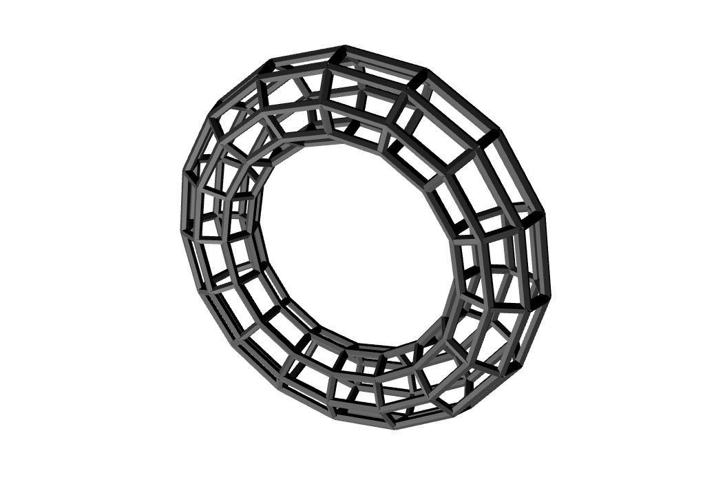

# three-tube-wireframe



Build a wireframe geometry made of cylinders from the input `THREE.Geometry`. This is expensive and leads to a *lot* of vertices, so its best suited for simple geometries.

Motivations:

- Thicker wireframes than what `gl.LINES` supports
- Volumetric wireframe meshes made up of cylindrical tubes
- Different face organization such as quads or cross-hatching lines

There are some limitations to this approach, including joins (no attempt is made to join the line segments) and occasional issues with different face organizations (this library makes assumptions about the layout of the incoming `THREE.Geometry`, which may not always be accurate).

Example:

```js
// Create a base geometry
const geometry = new THREE.TorusGeometry(1, 0.25, 8, 16);

// Now build a wireframe geometry out of it
const wireGeometry = createTubeWireframe(geometry, {
  thickness: 0.03, // thickness in world units of tubes
  radiusSegments: 6, // number of segments around the tubes
  mode: 'quad' // face layout, use quads instead of triangles
});

// And finally add it to the scene
const mesh = new THREE.Mesh(
  wireGeometry,
  new THREE.MeshPhysicalMaterial({
    color: 'white',
    roughness: 0.75,
    flatShading: true
  })
);
scene.add(mesh);
```

## Install

Use [npm](https://npmjs.com/) to install.

```sh
npm install three-tube-wireframe --save
```

It assumes `three` module is already installed and able to be required by your build tool.

## Usage

#### `wireGeo = createTubeWireframe(baseGeo, opt = {})`

Builds a new THREE.Geometry from `baseGeo` using the given options:

- `thickness` (default 1) thickness/radius of each individual tube

- `radiusSegments` (default 4) number of radial segments around each individual tube

- `lengthSegments` (default 1) number of segments along each individual tube

- `openEnded` (default false) whether tubes should be open or closed ended

- `matrix` (default identity) a `THREE.Matrix4` to apply to all segments as the geometry is being built

- `filter` (default pass-through) a function that accepts `(index, mode)` parameters and returns true (accept face) or false (discard face). If the mode is anything except `'triangle'`, the index will be incremented in steps of 2.

- `buffer` (defualt `false`) if `true`, returns a `THREE.BufferGeometry` with an additional `basePosition` attribute, which provides the positions of the original input `baseGeo` before wireframe expansion

- `mode` (string, default `'triangle'`) a face layout mode, can be one of the following. Some geometries (such as `THREE.IcosahedronGeometry`) may produce unusual results with non-triangle modes.
  - `'triangle'` build triangles
  - `'quad'` attempt to organize into quads
  - `'diagonal0'` or `'diagonal1'` diagonal lines in different directions
  - `'cross-hatch'` a mix of diagonal lines
  - `'horizontal'` or `'vertical'` straight lines
  - `'diagonal0-horizontal'` or `'diagonal1-horizontal'` a mix of diagonal and horizontal lines
  - `'diagonal0-vertical'` or `'diagonal1-vertical'` a mix of diagonal and vertical lines

#### `modes = createTubeWireframe.modes`

A list of all the mode names (`'triangle'`, `'quad'`, etc) that can be passed into the options.

## License

MIT, see [LICENSE.md](http://github.com/mattdesl/three-tube-wireframe/blob/master/LICENSE.md) for details.
